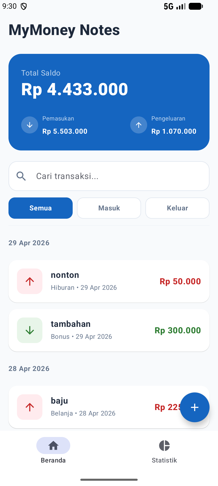
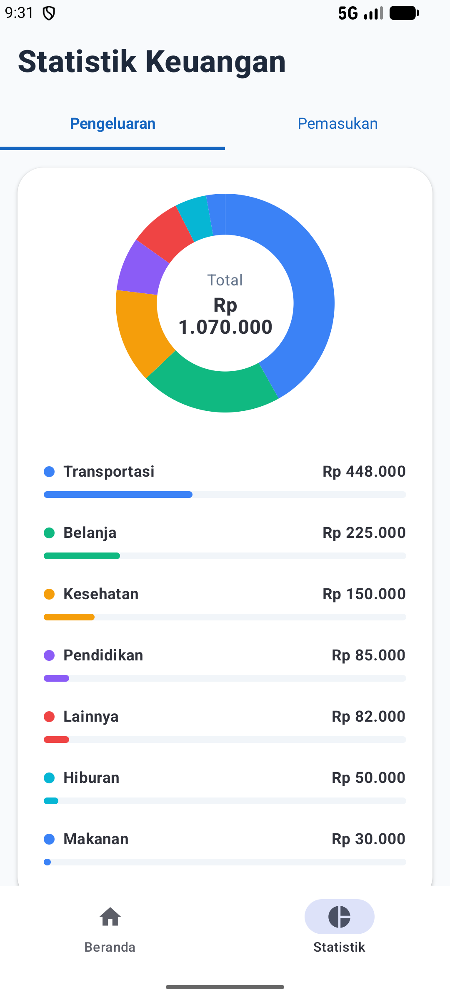
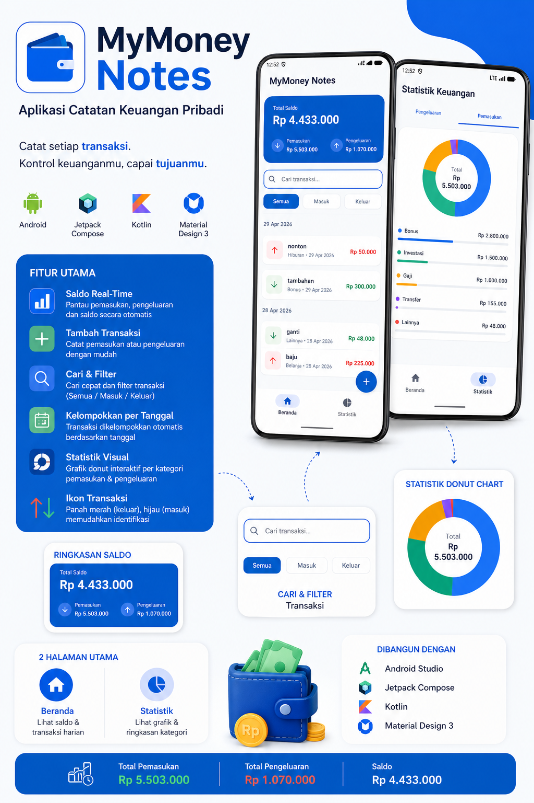

# 💰 MyMoney Notes

Aplikasi Android untuk mencatat dan memantau keuangan pribadi secara **mudah, cepat, dan real-time**.
Dibangun menggunakan **Kotlin + Jetpack Compose** dengan desain modern berbasis **Material Design 3**.

---

## 📱 Preview Aplikasi

| Beranda                         | Statistik                       |
| ------------------------------- | ------------------------------- |
|  |  |

---

## 🖼️ Infografis Aplikasi



---

## 🚀 Fitur Utama

* 💳 **Saldo Real-Time:**
  Menampilkan total saldo, pemasukan, dan pengeluaran secara otomatis

* ➕ **Tambah Transaksi:**
  Input transaksi pemasukan / pengeluaran dengan kategori & tanggal

* 🔍 **Pencarian Transaksi:**
  Cari transaksi dengan cepat melalui search bar

* 🧩 **Filter Transaksi:**
  Filter berdasarkan
  * Semua
  * Masuk
  * Keluar

* 📅 **Grouping by Tanggal:**
  Transaksi otomatis dikelompokkan per tanggal

* 📊 **Statistik Visual (Donut Chart):**
  Visualisasi proporsi kategori pemasukan & pengeluaran

* 🔄 **Tab Statistik:**
  Pisah antara
  * Pemasukan
  * Pengeluaran

* 🎯 **Ikon Transaksi:**

  * ⬆️ Merah = Pengeluaran
  * ⬇️ Hijau = Pemasukan

---

## 🛠️ Teknologi yang Digunakan

* Kotlin
* Jetpack Compose
* Material Design 3
* Android Studio
* Canvas / Chart API

---

## 🧱 Arsitektur & Konsep

* Declarative UI (Jetpack Compose)
* State Management (`remember`, `mutableStateOf`)
* Reactive UI
* Modular Component

---

## 📦 Instalasi

```bash
git clone https://github.com/aqilazn/MyMoneyNotes.git
```

Buka di Android Studio → Run 🚀

---
## 📝 Blogspot

👉 [Blog Project](https://your-blog-link.blogspot.com)


## 📊 Slide Presentasi (PPT)

👉 [Download PPT / Lihat Presentasi](https://canva.link/pktccbvnr1fqqw0)


## 📥 Download Aplikasi

👉 [Download APK](https://your-download-link.com)


## 🎥 Video Presentasi

👉 [YouTube Demo](https://youtube.com/your-video-link)

---

## 👨‍💻 Team Members

- 5025231138 - Aqila Zahira Naia Puteri Arifin 
- 5025231150 - Mazaya Khairana Nariswari
